# TextMe

The TextMe is a messaging chat application that allows texting with your friends and also with a AI assistant.

<div align="center" style="display: flex;">

</div>

## Technologies used

TextMe was built using different technologies, here are some of them and where each one was used.

- **ReactJS**: Used in the TextMe webpage application construction.
- **NestJS**: Used to build the TextMe server API.
- **Socket.io**: Used to send instant text messages from one user to another.
- **Prisma ORM**: Used as server ORM to interact with the Database.
- **PostgreSQL**: The database used in TextMe application.
- **Fastify**: Used to build the OpenAI microservice that works as an used in the TextMe application for the users to interact with an AI friend.
- **RabbitMQ**: Used to queue the OpenAI microservice messaging requests sent by the users.
- **Redis**: Used by the OpenAI microservice to temporarily save the messaging context of the conversations with the AI assistant (This is going to be made in a separated database in the future).
- **OpenAI API**: Used to allow users to interact with Chat GPT (`gpt-3.5-turbo`) inside TextMe app.

## TextMe Services overview

Currently the TextMe application count with 3 main services, the **Front-End client application**, the **TextMe API Server** and the **OpenAI microservice**. Here is a diagram of how each one of these services interact with each other and with external services as **PostgreSQL**, **Redis**, **RabbitMQ** and **OpenAI API**.

```mermaid
flowchart LR
  subgraph TextMe
  
  subgraph TextMeServer [TextMe Server]
  SERVER_HTTP(Http Routers)
  SERVER_SOCKET_IO(Socket.io)
  SERVER_PRISMA(Prisma ORM)
  end

  APP(Front-End) <-.-> |"Chat (websocket)"| SERVER_SOCKET_IO
  APP <--> |"Http Requests (login, signup, etc)"| SERVER_HTTP
  SERVER_PRISMA <--> |"Stores (postgres/TCP)"| DB[(PostgreSQL)]

  SERVER_SOCKET_IO <-.->|"Chat (websocket)"| AI_MICRO(OpenAI Microservice)
  AI_MICRO --> |"Store Cache (redis/TCP)"| REDIS[(Redis)]
  end

  subgraph OpenAI
  OPENAI[OpenAI API] <--> |"Http Requests (AI Chat Completions)"| AI_MICRO
  end

  subgraph RabbitMQ
  EXCHANGE["Exchange (Direct)"] -->|Routing| Q1[Queue 1]
  end

  AI_MICRO -->|Publish| EXCHANGE
  Q1 -->|Consume| AI_MICRO

  style TextMeServer fill:#333,stroke:#fff,stroke-width:0.5px
```



The **OpenAI Microservice** here works as a normal user, it also have it's own registry on the TextMe application. But every time it receives a new message from a user, publishes this message as a new request to the RabbitMQ that will later be consumed by the Microservice itself in order to send to the OpenAI and receive a response from the ChatGPT (`gpt-3.5-turbo`).

# Getting started

## Running the TextMe Demo

As you saw, we have many services here to run before having the application ready to try. Thinking about that, I made a Demo where you can run few commands and get the application up and running in your machine using Docker.

- To do that you will have to [install the Docker](https://www.docker.com/) in your machine. 
- Then you can start the `PostgreSQL`, `Redis` and `RabbitMQ`running the script below (you might need to run `chmod +x run-services.sh` first):

```bash
./run-services.sh
```

- Ok, now you're good to go and run the script to start the TextMe Server, Web Client and OpenAI Microservice (you might need to run `chmod +x run-demo.sh` first):

```bash
./run-demo.sh
```

- This command will start the TextMe Server, start the OpenAI Microservice which will connect with Server Websocket as a user and will start the Client application that will be available in `http://localhost:3000`.
- The TextMe Demo already have two users created that you can start playing with, Alice and Bob:

**Alice credentials:**
```text
Email: alice@gmail.com
Password: 12345678
```

**Bob credentials:**
```text
Email: bob@gmail.com
Password: 12345678
```

## Run the projects in your machine

To get the whole project running in your machine instead of Docker, you must go to the respective folders of each service below. It's recommended to execute in this order:

- [Server](./server)
- [OpenAI Microservice](./openai-microservice/)
- [Client](./client)