```mermaid
flowchart LR
  subgraph TextMe
  
  subgraph TextMeServer [TextMe Server]
  SERVER_HTTP(Http Routers)
  SERVER_SOCKET_IO(Socket.io)
  SERVER_PRISMA(Prisma ORM)
  end

  APP(Front-End) <-.-> |"Chat (websocket)"| SERVER_SOCKET_IO
  APP <--> |"Http Requests (login, signup, etc)"| SERVER_HTTP
  SERVER_PRISMA <--> |"Stores (postgres/TCP)"| DB[(PostgreSQL)]

  SERVER_SOCKET_IO <-.->|"Chat (websocket)"| AI_MICRO(OpenAI Microservice)
  AI_MICRO --> |"Store Cache (redis/TCP)"| REDIS[(Redis)]
  end

  subgraph OpenAI
  OPENAI[OpenAI API] <--> |"Http Requests (AI Chat Completions)"| AI_MICRO
  end

  subgraph RabbitMQ
  EXCHANGE["Exchange (Direct)"] -->|Routing| Q1[Queue 1]
  end

  AI_MICRO -->|Publish| EXCHANGE
  Q1 -->|Consume| AI_MICRO

  style TextMeServer fill:#333,stroke:#fff,stroke-width:0.5px
```

# TextMe

The TextMe is a messaging chat application that allows texting with your friends and also with a AI assistant.

## Technologies used

TextMe was built using different technologies, here are some of them and where each one was used.

- **ReactJS**: Used in the TextMe webpage application construction.
- **NestJS**: Used to build the TextMe server API.
- **Socket.io**: Used to send instant text messages from one user to another.
- **Prisma ORM**: Used as server ORM to interact with the Database.
- **PostgreSQL**: The database used in TextMe application.
- **Fastify**: Used to build the OpenAI microservice that works as an used in the TextMe application for the users to interact with an AI friend.
- **RabbitMQ**: Used to queue the OpenAI microservice messaging requests sent by the users.
- **Redis**: Used by the OpenAI microservice to temporarily save the messaging context of the conversations with the AI assistant (This is going to be made in a separated database in the future).

## TextMe Services overview

Currently the TextMe application count with 3 main services, the **Front-End client application**, the **TextMe API Server** and the **OpenAI microservice**. Here is a diagram of how each one of these services interact with themselves.

## Getting started

Checkout the description of the client side and server side:

- [Client](./client)
- [Server](./server)