# OpenAI Microservice

This is a OpenAI Microservice created to participate in the chat as another user. As a normal user, it has it's own email and password and it can receive and respond other users through TextMe message chat.

## Technologies used

- **Fastify**: Used to build the OpenAI microservice that works as an used in the TextMe application for the users to interact with an AI friend.
- **RabbitMQ**: Used to queue the OpenAI microservice messaging requests sent by the users.
- **Redis**: Used by the OpenAI microservice to temporarily save the messaging context of the conversations with the AI assistant (This is going to be made in a separated database in the future).
- **OpenAI API**: Used to allow users to interact with Chat GPT (`gpt-3.5-turbo`) inside TextMe app.

## OpenAI Microservice Services overview

Here is a simple flowchart that illustrates the OpenAI Microservice with other services. Go to the [Project Root Readme](../README.md) to see the complete flowchart.

```mermaid
flowchart LR
  subgraph TextMe
  
  subgraph TextMeServer [TextMe Server]
  SERVER_SOCKET_IO(Socket.io)
  end

  SERVER_SOCKET_IO <-.->|"Chat (websocket)"| AI_MICRO(OpenAI Microservice)
  AI_MICRO --> |"Store Cache (redis/TCP)"| REDIS[(Redis)]
  end

  subgraph OpenAI
  OPENAI[OpenAI API] <--> |"Http Requests (AI Chat Completions)"| AI_MICRO
  end

  subgraph RabbitMQ
  EXCHANGE["Exchange (Direct)"] -->|Routing| Q1[Queue 1]
  end

  AI_MICRO -->|Publish| EXCHANGE
  Q1 -->|Consume| AI_MICRO

  style TextMeServer fill:#333,stroke:#fff,stroke-width:0.5px
```



# Getting started

## Instalations

First you need to install the dependencies of the project.

```
yarn
```

or

```
npm i
```

## Environmental Variables

Create a `.env` file in root project. Fill all the keys of the content below with their respective values.

```text
# Environment
NODE_ENV=development

# TextMe Server access
USER_ID=
USER_EMAIL=
USER_PASSWORD=

# TextMe websocket server
WEBSOCKET_SERVER='http://localhost:3333'

# Redis
REDIS_HOST=
REDIS_PORT=6379
REDIS_PASSWORD=

# RabbitMQ
RABBITMQ_HOST=
RABBITMQ_PORT=15672
RABBITMQ_USER=
RABBITMQ_PASSWORD=

# OpenAI
OPENAI_KEY=
OPENAI_ORGANIZATION=
OPENAI_PROJECT=
```

Define the user ID, email and password for login in TextMe. And define your OpenAI key. If you use the default created by the TextMe Server seed, you can use the credentials:

```
USER_ID=8288fa32-1c78-42ed-b731-60b400531b24
USER_EMAIL=openai@gmail.com
USER_PASSWORD=12345678
```

## Running project
Remember to run the TextMe Server first!

```
yarn start:dev
```

```
npm run start:dev
```

The OpenAI Microservice will be running at `http://localhost:3001`

# Links

- [Fastify Docs](https://fastify.dev/docs/latest/)
- [RabbitMQ Docs](https://www.rabbitmq.com/docs)
- [Redis Docs](https://redis.io/docs/latest/)
- [OpenAI API Docs](https://platform.openai.com/docs/concepts)